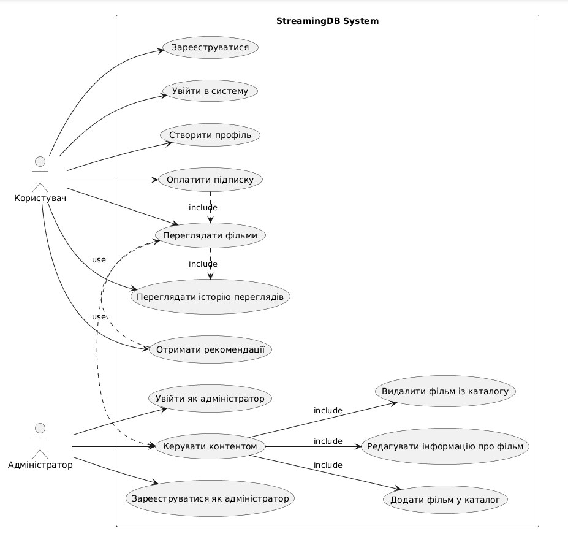

# Use case diagram

## Зміст
1. Декларативна модель
2. Функціональні вимоги
3. Нефункціональні вимоги
4. Матриця трасування

## 1. Декларативна модель

Файл: [use_case_diagram.puml](StreamingDBUseCaseDiagram.puml) 

## 2. Функціональні вимоги

| ID | Пов’язані Use Cases | Формулювання вимоги |
|----|----------------------|----------------------|
| **FR1** | UC1, UC2 | Система має забезпечувати реєстрацію користувачів і вхід у систему. |
| **FR2** | UC3, UC6 | Користувач може переглядати фільми лише після оплати підписки. |
| **FR3** | UC3, UC4 | Під час перегляду фільмів система повинна фіксувати історію переглядів користувача. |
| **FR4** | UC3, UC7 | Система повинна надавати рекомендації на основі історії переглядів і вподобань користувача. |
| **FR5** | UC5, UC1 | Після реєстрації користувач може створити профіль з персональними даними. |
| **FR6** | UC8, UC11 | Адміністратор може додавати нові фільми до каталогу через модуль керування контентом. |
| **FR7** | UC12, UC11 | Адміністратор може редагувати інформацію про фільми у каталозі. |
| **FR8** | UC13, UC11 | Адміністратор може видаляти фільми з каталогу. |
| **FR9** | UC9, UC10 | Система має підтримувати реєстрацію та автентифікацію адміністраторів. |
| **FR10** | UC3, UC11 | Користувач може переглядати фільми, додані адміністратором. |

### 3. Не функціональні вимоги

| ID | Пов’язані Use Cases | Формулювання вимоги                                                                                                          |
|----|----------------------|------------------------------------------------------------------------------------------------------------------------------|
| **NFR1** | UC1–UC13 | Система має бути доступною 99% часу                                                                                          |
| **NFR2** | UC2, UC3, UC6 | Критичні операції, такі як вхід у систему, перегляд фільмів і оплата підписки, повинні виконуватися швидко (менше 3 секунд). |
| **NFR3** | UC1–UC13 | Усі дії користувачів і адміністраторів повинні здійснюватися через захищене з’єднання (HTTPS).                               |
| **NFR4** | UC2, UC3, UC5 | Інтерфейс має бути адаптивним і коректно відображатися на мобільних пристроях.                                               |
| **NFR5** | UC11–UC13 | Система повинна забезпечувати контроль доступу, щоб лише адміністратори могли керувати контентом.                            |
| **NFR6** | UC1–UC10 | Система повинна підтримувати розмежування ролей користувача та адміністратора.                                               |
| **NFR7** | UC3, UC7 | Рекомендаційний модуль має оновлювати дані з історії переглядів у реальному часі або з мінімальною затримкою.                |
| **NFR8** | UC6 | Інтеграція з платіжною системою має бути стабільною, із підтвердженням транзакцій та обробкою помилок.                       |
| **NFR9** | UC1–UC13 | Система повинна зберігати персональні дані відповідно до вимог безпеки та конфіденційності (GDPR/HIPAA).                     |
| **NFR10** | UC1–UC13 | Система повинна підтримувати масштабованість для обробки великої кількості користувачів одночасно.                           |

### 4. Матриця трасування

### Матриця трасування функціональних вимог

| ID вимоги | Тип | Пов’язані Use Cases | Обґрунтування |
|------------|------|----------------------|----------------|
| **FR1** | Functional | UC1, UC2 | Забезпечує автентифікацію користувачів, необхідну для доступу до системи. |
| **FR2** | Functional | UC3, UC6 | Реалізує бізнес-логіку платного доступу: перегляд фільмів можливий лише після оплати підписки. |
| **FR3** | Functional | UC3, UC4 | Фіксує історію переглядів користувача під час використання сервісу. |
| **FR4** | Functional | UC3, UC7 | Формує рекомендації на основі даних про перегляди та вподобання користувача. |
| **FR5** | Functional | UC5, UC1 | Дозволяє користувачу створювати персональний профіль після реєстрації. |
| **FR6** | Functional | UC8, UC11 | Дозволяє адміністратору додавати нові фільми до каталогу через модуль керування контентом. |
| **FR7** | Functional | UC12, UC11 | Надає адміністратору можливість редагувати інформацію про фільми. |
| **FR8** | Functional | UC13, UC11 | Забезпечує видалення фільмів із каталогу адміністратором. |
| **FR9** | Functional | UC9, UC10 | Підтримує реєстрацію та вхід адміністраторів для розмежування доступу. |
| **FR10** | Functional | UC3, UC11 | Забезпечує доступ користувачів до контенту, який додає адміністратор. |
