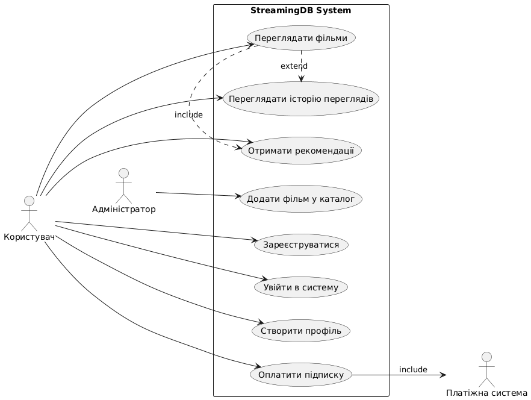

# Use case diagram

## Зміст
1. Декларативна модель
2. Функціональні вимоги
3. Нефункціональні вимоги

## 1. Декларативна модель

Файл: [use_case_diagram.puml](StreamingDBUseCaseDiagram.puml) 

## 2. Функціональні вимоги

| ID | Тип | Опис |
|---|---|---|
| FR1 | Functional | Користувач може зареєструватися у системі |
| FR2 | Functional | Користувач може увійти у свій акаунт |
| FR3 | Functional | Користувач може переглядати доступні фільми |
| FR4 | Functional | Користувач може створювати кілька профілів |
| FR5 | Functional | Користувач може переглядати історію переглядів |
| FR6 | Functional | Користувач може отримувати рекомендації на основі історії |
| FR7 | Functional | Користувач може оплатити підписку через зовнішню платіжну систему |
| FR8 | Functional | Адміністратор може додавати нові фільми до каталогу |

## 3. Нефункціональні вимоги
| ID | Тип | Опис |
|---|---|---|
| NFR1 | Non-Functional | Система повинна бути доступна 24/7 |
| NFR2 | Non-Functional | Час відповіді системи не повинен перевищувати 2 секунд |
| NFR3 | Non-Functional | Дані користувачів передаються захищеним з’єднанням (HTTPS) |
| NFR4 | Non-Functional | Інтерфейс повинен підтримувати мобільні пристрої |
